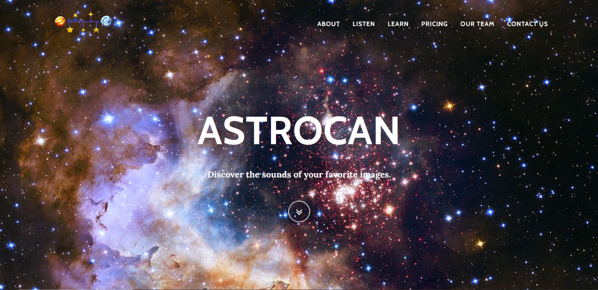
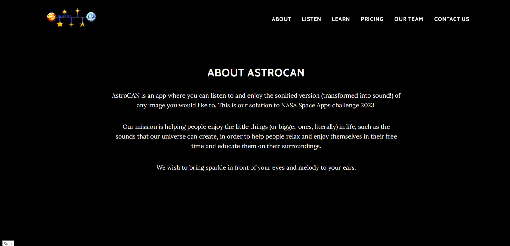
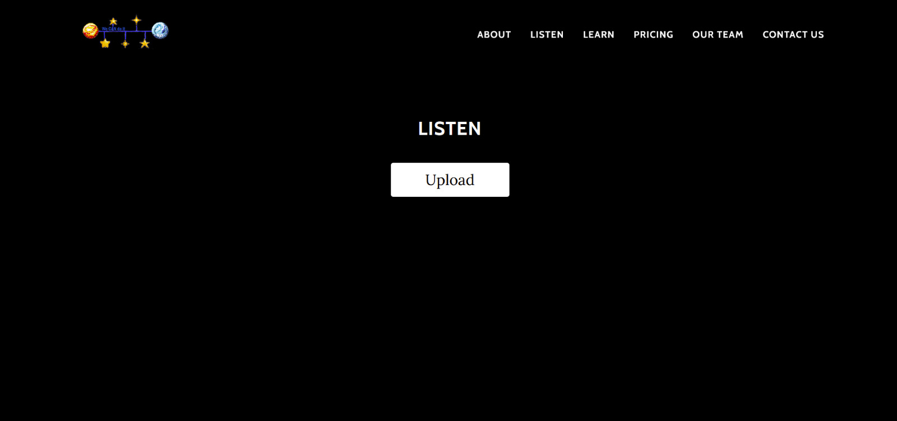
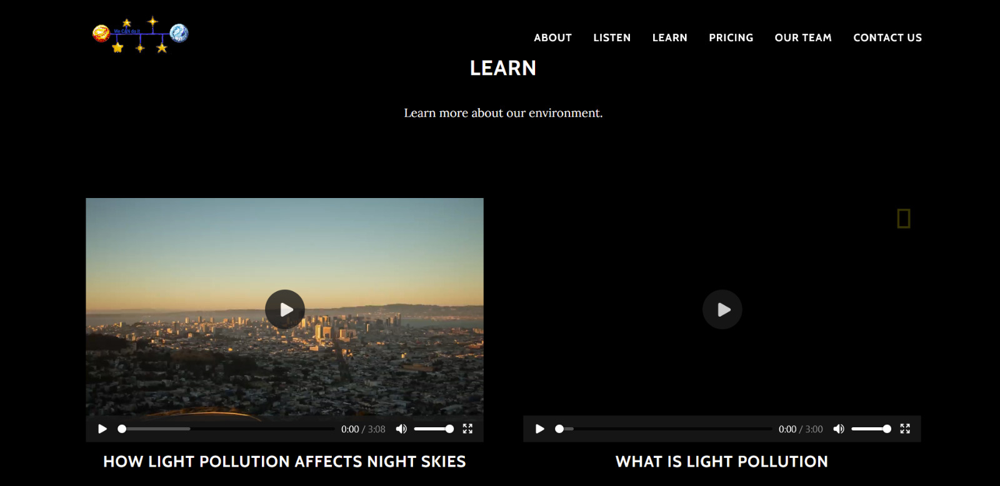
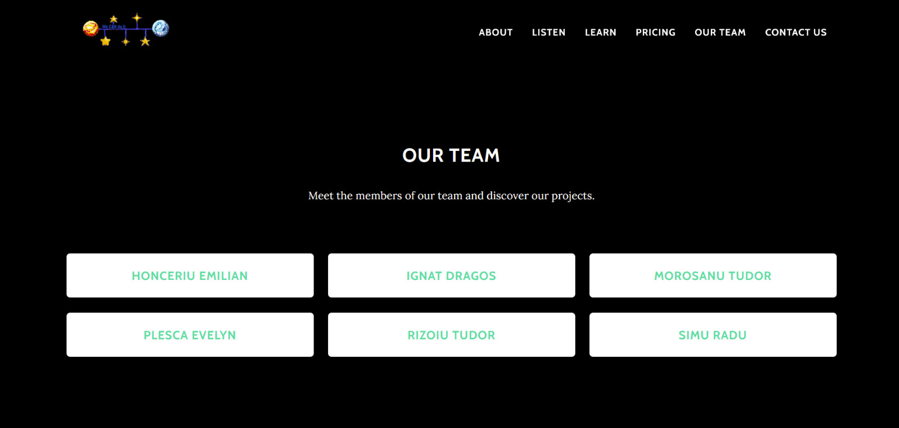
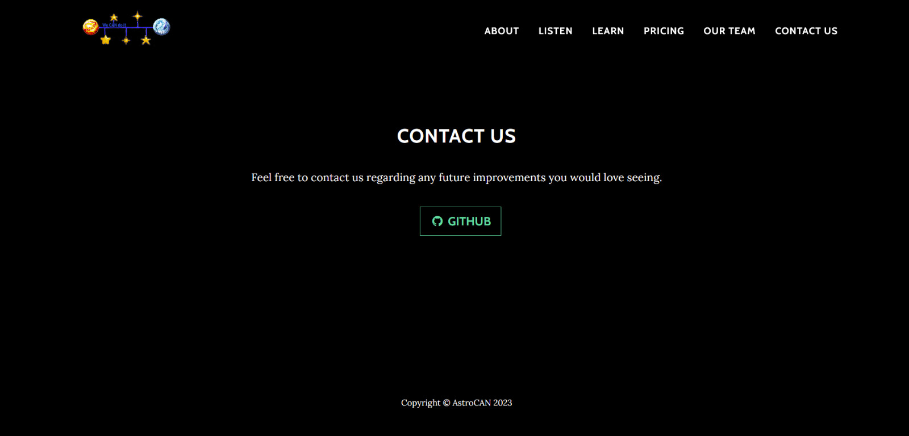

# AstroCAN
## Description
This is our solution for the NASA Space Apps 2023 hackathon at the Immersed in the Sounds of Space challenge.
We developed an image to sound recognition algorithm that is used in the application and enables users to upload any image (altough we recomment spatial images from NASA) and generate sounds based on them and offers a space for meditation for people of all ages and stages of life.
Users can also access a Learning side of the page, see the About, Pricing and Contact sections.
For future development, we wish to continue this project in order to aid visually impaired individuals.

## Features
### Main page
The web app showcases a startup page that includes the title of our app, a little motto and has a menu where you can get to all the parts of our app.
 
 

### About
This page shows the intents of our application and the things that you can do using it.
 
 

### Listen
This page is the main part of our application - it has a button where you can upload any image (we recommand a space themed one) and it generates a sound based off the image that the user has uploaded. We recommend using this sound in order to meditate and imagine being among the stars, planets or anything else is in the picture that you have just uploaded.
 
 

### Learning
We want to make our web app as educational as possible and because of this, we included two videos that can be played and that we plan on changing periodically in order to educate our users. Right now, the videos uploaded on AstroCAN are related to Light Pollution.
 
 

### Pricing page
This page showcases the pricing options that we plan on implementing.
Our page will be mostly free, but in order to get the full experience of meditation using sounds generated from your own images, you will be able to download the generated sounds and access them offline with the pro subscription package.
 
 

### Team
We wanted to show credits to the people who created this website :) (yes, us)
 
 

### Contact 
We included a contact page that redirects the user to the Github page with the source of the project and we are open to any suggestions on improving it.
 
 

## Used technologies
- MATLAB
- Python
- HTML5
- CSS3
- React
- Bootstrap

## Sustainability
- Simple UI, doesn't require a lot of energy to run
- It enhances brain function, productivity etc. through meditation induced by calming sounds and visual stimulation
- Servers that host data run on solar energy, as opposed to the starry night theme of the app
- Raising awareness through educational videoclips
- Offline premium content
We offer the possibility of accessing offline meditation sources, by buying a monthly subscription plan
that allows you to download the sound contents generated using our app.

## Contributors
- Honceriu Emilian
- Ignat Dragos
- Morosanu Tudor
- Plesca Evelyn
- Rizoiu Tudor
- Simu Radu
